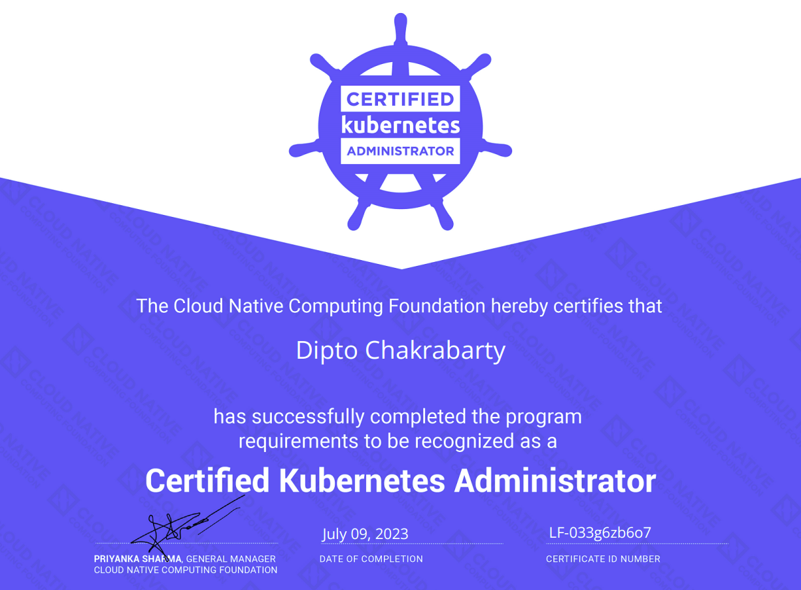

# The complete CKA guide

This repository contains all related content and examples you require to pass the CKA certification

## Table of Contents

- Overview
- Folder Structure
- Learning Resources
- Contributing
- Contribution Practices

### Overview

I passed the CKA certification with 94% and this repository has my complete notes and examples that any beginner can follow along with tips on how to ace the exam.

All the content here is from the learning resources I used to study from.

### Folder Structure

The repository is split into multiple folders based on what is asked and questions in the exam.
Each topic has an associated Readme file with it.

### Learning Resources

- [Certified Kubernetes Administrator (CKA) with Practice Tests](https://www.udemy.com/course/certified-kubernetes-administrator-with-practice-tests/)
- [YouTube Playlist by Alok Kumar](https://www.youtube.com/@AlokKumar/playlists)
- [Ultimate CKA ](https://www.udemy.com/course/ultimate-cka-certified-kubernetes-administrator/)
- ChatGPT : Generate unlimited CKA related scenarios and examples
- Kubectl cheatSheet - > Quick-kubectl.md

### Contributing
When contributing to this repository, please first discuss the change you wish to make via issue, email, or any other method with the owners of this repository before making a change.

If anyone wants to take up an issuse they are free to do so .

### Contribution Practices
Please be respectful of others , do not indulge in unacceptable behaviour
If a person is working or has been assigned an issue and you want to work on it please ask him/her if he is working on it
We are happy to allow you to work on your issues , but in case of long period of inactivity the issue will be approved to another volunteer
If you report a bug please provide steps to reproduce the bug.
In case of changing the backend routes please submit an updated routes documentation for the same.
If there is an UI related change it would be great if you could attach a screenshot with the resultant changes so it is easier to review for the maintainers